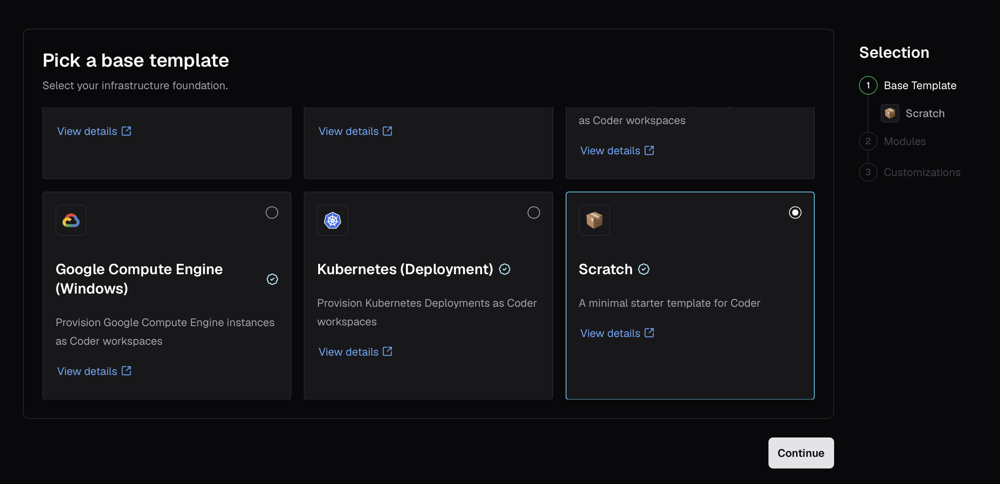
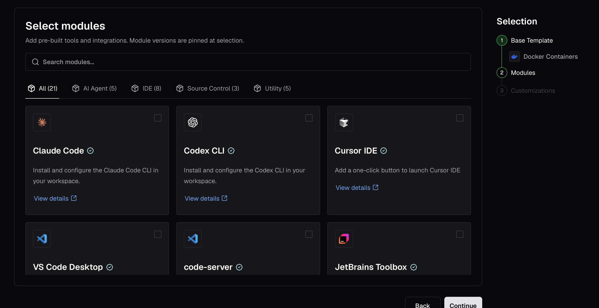
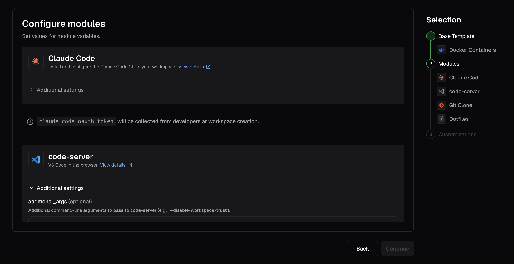
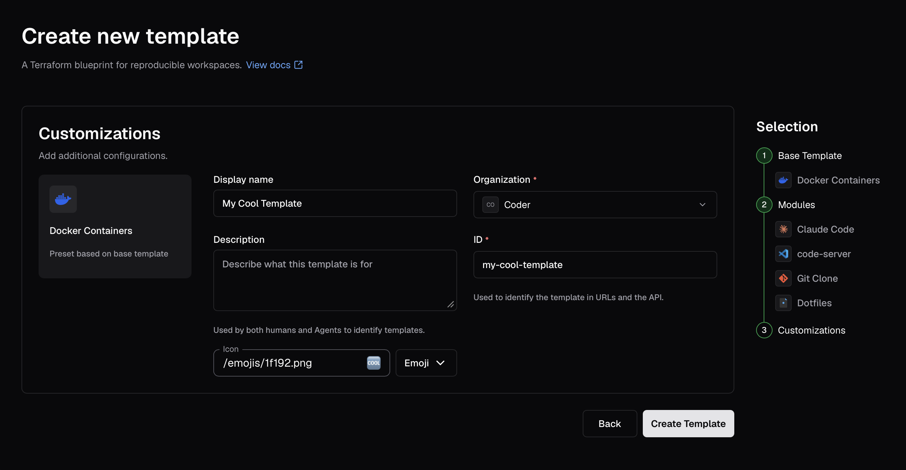

# Creating Templates

Users with the `Template Administrator` role or above can create templates
within Coder.

## From a starter template

In most cases, it is best to start with a starter template.

<div class="tabs">

### Template builder

The template builder is the recommended way to create templates in Coder. It
guides you through selecting a base infrastructure template, adding modules
(IDEs, tools, integrations), and configuring your template, all without writing
Terraform.

The template builder is enabled by default. When you select **New Template** on
the **Templates** page, the builder opens automatically.

The builder guides you through up to five steps:

1. **Select base infrastructure**: Choose a starter template for your target
   platform (e.g. Docker, AWS EC2, Kubernetes). Each base template provides a
   working foundation with the Coder agent pre-configured.

   

1. **Base template parameters** *(optional)*: If the selected base template
   declares configurable variables, you can supply values for them here.
   If the base template has no parameters, this step is skipped automatically.

1. **Select modules**: Pick from a curated list of
   [registry modules](https://registry.coder.com) to add IDEs, AI agents,
   source control integrations, and other tools. Modules are grouped by
   category and filtered for compatibility with the selected base template's
   operating system. You can select multiple modules.

   

1. **Module settings** *(optional)*: Configure variables for the modules you
   selected. Required variables without defaults must be filled in before you
   can proceed. Modules that require secrets (such as API keys) display a
   notice that developers will be prompted for the value at workspace creation
   time.

   

1. **Template customizations**: Set the template's display name, description,
   icon, and organization, then select **Create Template**.

   

After you select **Create Template**, Coder composes the Terraform
configuration server-side, validates it with `terraform init` and
`terraform validate`, and creates the template. The generated template is
standard Terraform HCL that you can edit later through the dashboard or CLI.

> [!NOTE]
> The template builder requires outbound access to `registry.coder.com` so
> that `terraform init` can resolve module sources. For air-gapped or
> restricted-egress deployments, visit
> [Air-gapped deployments](../../install/airgap.md#template-builder).

If you select modules that are known to conflict with each other, the builder
displays a warning. Module conflicts do not block template creation, but you
should review the warning before proceeding.

#### Disabling the template builder

Operators can disable the template builder by setting the
`CODER_DISABLE_TEMPLATE_BUILDER` environment variable or the
`--disable-template-builder` server flag. When disabled, the **New Template**
button links to the starter templates page instead, and the
`/api/v2/templatebuilder/*` endpoints return 404.

Deployments using a self-hosted module registry mirror can set
`CODER_TEMPLATE_BUILDER_REGISTRY_URL` to point generated module source paths at
the mirror instead of `registry.coder.com`.

#### Alternative creation methods

The template builder's first step also links to alternative creation paths:

- **Upload an existing template**: Upload a `.tar.gz` or `.zip` of Terraform
  files you have authored locally.
- **Start from scratch**: Follow the
  [template from scratch tutorial](../../tutorials/template-from-scratch.md) to
  write Terraform by hand.
- **Browse community templates**: Browse the
  [Coder Registry](https://registry.coder.com/templates) for community and
  official templates.

### CLI

You can use the [Coder CLI](../../install/cli.md) to manage templates for Coder.

After [logging in](../../reference/cli/login.md) to your deployment, create a
folder to store your templates:

```sh
# This snippet applies to macOS and Linux only
mkdir $HOME/coder-templates
cd $HOME/coder-templates
```

Use the [`templates init`](../../reference/cli/templates_init.md) command to
pull a starter template:

```sh
coder templates init
```

After pulling the template to your local machine (e.g. `aws-linux`), you can
rename it:

```sh
# This snippet applies to macOS and Linux only
mv aws-linux universal-template
cd universal-template
```

Next, push it to Coder with the
[`templates push`](../../reference/cli/templates_push.md) command:

```sh
coder templates push
```

If `templates push` fails, it is likely that Coder is not authorized to deploy
infrastructure in the given location. Learn how to configure
[provisioner authentication](../provisioners/index.md).

You can edit the metadata of the template such as the display name with the
[`templates edit`](../../reference/cli/templates_edit.md) command:

```sh
coder templates edit universal-template \
  --display-name "Universal Template" \
  --description "Virtual machine configured with Java, Python, Typescript, IntelliJ IDEA, and Ruby. Use this for starter projects. " \
  --icon "/emojis/2b50.png"
```

### CI/CD

Follow the [change management](./managing-templates/change-management.md) guide
to manage templates via GitOps.

</div>

## From an existing template

You can duplicate an existing template in your Coder deployment. This copies
the template code and metadata, allowing you to make changes without affecting
the original template.

<div class="tabs">

### Web UI

After navigating to the page for a template, use the dropdown menu on the right
to `Duplicate`.


Give the new template a name, icon, and description.


Press `Create template`. After the build, you will be taken to the new template
page.


### CLI

First, ensure you are logged in to the control plane as a user with permissions
to read and write permissions.

```console
coder login
```

You can list the available templates with the following CLI invocation.

```console
coder templates list
```

After identified the template you'd like to work from, clone it into a directory
with a name you'd like to assign to the new modified template.

```console
coder templates pull <template-name> ./<new-template-name>
```

Then, you can make modifications to the existing template in this directory and
push them to the control plane using the `-d` flag to specify the directory.

```console
coder templates push <new-template-name> -d ./<new-template-name>
```

You will then see your new template in the dashboard.

</div>

## From scratch (advanced)

There may be cases where you want to create a template from scratch. You can use
[any Terraform provider](https://registry.terraform.io) with Coder to create
templates for additional clouds (e.g. Hetzner, Alibaba) or orchestrators
(VMware, Proxmox) that we do not provide example templates for.

Refer to the following resources:

- [Tutorial: Create a template from scratch](../../tutorials/template-from-scratch.md)
- [Extending templates](./extending-templates/index.md): Features and concepts
  around templates (agents, parameters, variables, etc)
- [Coder Registry](https://registry.coder.com/templates): Official and community
  templates for Coder
- [Coder Terraform Provider Reference](https://registry.terraform.io/providers/coder/coder)

### Next steps

- [Extending templates](./extending-templates/index.md)
- [Managing templates](./managing-templates/index.md)
